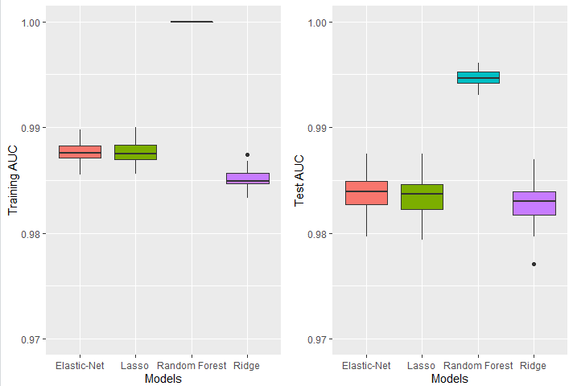
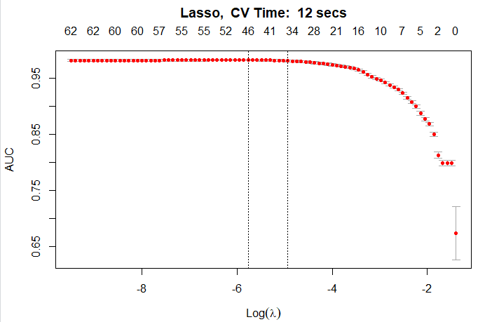
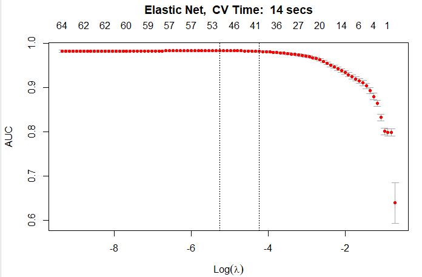
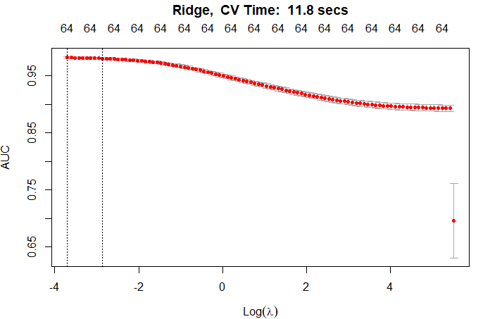
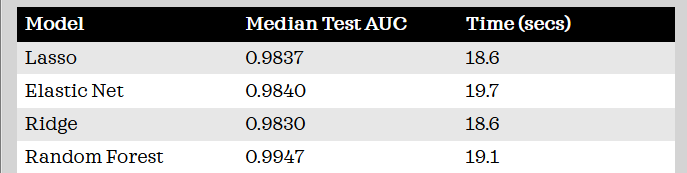
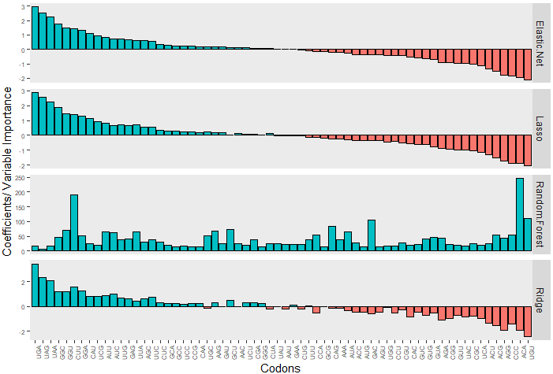

# Classifying Species

## Dataset
 Source: [UCI- Codon Usage Data](https://archive.ics.uci.edu/ml/datasets/Codon+usage)

The original data has 13,028 rows and 68 features excluding the target variable. The target variable is Kingdom and it has 11 classes. Few of the classes are given below: 
 - arc (archaea)
 - bct (bacteria) 
 - pln (plant)  
 - mam (mammal) 
 - vrl (virus)

Few of the features are:
- specie's name
- specie's ID
- DNA Type
- Number of Codons
- Frequencies of 64 codons (64 columns). Some Codons are given below:  
    - UUU: codes for amino acid phenylalanine
    - CUU: codes for amino acid leucine
    - GGU: codes for amino acid valine

This dataset uses codon frequencies to classify species to one of the Kingdoms. Each codon form a unit of genetic code in DNA or RNA, and they code for different amino acids. Few examples can be seen above. 

As for our analysis, we only used a subset of the dataset. Because we are doing binary classification, we filtered the observations that only contained the following two classes for Kingdom: 
- Pln (plant) -> 0 (Negative)
- Vrl (virus) -> 1 (Positive)

The class imbalance ratio is 2523/2831 = 0.89. Therefore there was not a big imbalance between the two classes. 

The dataset didn't have any missing values. We removed the columns that were not codon frequencies. Columns that we removed were:
- specie's name
- specie's ID
- DNA Type
- Number of Codons

So after all this, we had 5,354 rows and 64 features, exlcuding the response variable. 
 
## Analysis
We split our dataset into training and test sets. Training set had 65% of the data and the test set had 35% of the data. We fitted logistic elastic net, logistic lasso, logistic ridge and random forest, to our training dataset and computed the AUC values for both the training and test data. This was repeated 50 times. Given below are the boxplots for the AUC values for each model:

From the figure above, we can see that all four models performed really well on both the training and the test data, as the median AUC for all of them is above 0.98. Random forest performs slightly better than logistic lasso, ridge and elastic net. And we notice that the test AUC values have higher variabilty compared to the training AUC values. 

We also plotted cross validation curves for the 45th sample. We can see the log(lambda) interval at which the AUC is the highest. And we see the number of non-zero coefficients for log(lambda) interval where the perfromance of each model is the best. We use the minimum lambda values to fit logistic lasso, ridge and elastic net. Also, it takes very similar time to cross validate the three models. It took 12 secs for Lasso, 14 seconds for elastic net and 11.8 seconds for ridge. The cross validation curves are given below:

Then we analyzed each model for how well they classified the species in the test set and the time it took to fit them. The table is given below: 

We observe that all models perform really well with median test AUC of above 0.98. Random forest perfroms slightly better. And because our data set is small, the time vs. accuracy trade-off is not obvious. Maybe if we had a large dataset, we would have seen the difference in time for model fitting and performance of each model. 

For the final part of the analysis, we plotted coefficients from logistic lasso, logistic ridge and logistic elastic net and variable importance from random forest. Below are the plots:

We notice that for lasso, elastic net and ridge, most important codons with  positive coefficents are UGA, UAG & UAA, which means that they are the most important when classifying a species as plant. On the other hand, UGU, ACA & CCC are the most important codons with negative coefficients for elastic net and lasso, which means they are most important to classify species as virus. For ridge, most important codons with negative coefficeints are UGU, ACA & AGG. And for random forest, ACA, CUU, UGU & GAC are most important variables. 

## Conclusion
In this project we used the codon usage dataset from UCI. We classified species to one of the two kingdoms, plant or virus, using logistic lasso, logistic elastic net, logistic ridge, and random forest. All four models performed really well on both training and test datasets.  
